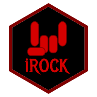

<!-- README.md is generated from README.Rmd. Please edit that file -->

```{r setup, include=FALSE}

knitr::opts_chunk$set(
  collapse = TRUE,
  comment = "#>",
  fig.path = "man/figures/README-",
  out.width = "100%"
)

# install.packages('pkgnet');

packagename <- 'rock';
packageSubtitle <- "Reproducible Open Coding Kit";

gitLab_ci_badge <-
  paste0("https://gitlab.com/r-packages/", packagename, "/badges/prod/pipeline.svg");
gitLab_ci_url <-
  paste0("https://gitlab.com/r-packages/", packagename, "/-/commits/prod");

codecov_badge <-
  paste0("https://codecov.io/gl/r-packages/", packagename, "/branch/prod/graph/badge.svg");
codecov_url <-
  paste0("https://app.codecov.io/gl/r-packages/", packagename, "?branch=prod");

dependency_badge <-
  paste0("https://tinyverse.netlify.com/badge/", packagename);
dependency_url <-
  paste0("https://CRAN.R-project.org/package=", packagename);

pkgdown_url_dev <-
  paste0("https://r-packages.gitlab.io/", packagename);
pkgdown_url_prod <-
  paste0("https://", packagename, ".opens.science");

cran_url <-
  paste0("https://cran.r-project.org/package=", packagename);
cranVersion_badge <-
  paste0("https://www.r-pkg.org/badges/version/", packagename, "?color=brightgreen");
cranLastMonth_badge <-
  paste0("https://cranlogs.r-pkg.org/badges/last-month/", packagename, "?color=brightgreen");
cranTotal_badge <-
  paste0("https://cranlogs.r-pkg.org/badges/grand-total/", packagename, "?color=brightgreen");

```

<!-- badges: start -->
[](`r cran_url`)
[](`r cran_url`)
[](`r cran_url`)
<!-- [](`r dependency_url`) -->
<!-- badges: end -->

#  `r paste(packagename, "\U1F4E6")`

## `r packageSubtitle`

The pkgdown website for this project is located at `r pkgdown_url_prod`.

<!--------------------------------------------->
<!-- Start of a custom bit for every package -->
<!--------------------------------------------->

The Reproducible Open Coding Kit ('ROCK', and this package, 'rock')
was developed to facilitate reproducible and open coding, specifically
geared towards qualitative research methods. It was developed to be both
human- and machine-readable, in the spirit of MarkDown and 'YAML'. The idea is
that this makes it relatively easy to write other functions and packages
to process 'ROCK' files. The 'rock' package contains functions for basic
coding and analysis, such as collecting and showing coded fragments and
prettifying sources, as well as a number of advanced analyses such as the
Qualitative Network Approach and Qualitative/Unified Exploration of State
Transitions. The 'ROCK' and this 'rock' package are described in the ROCK
book (Zörgő & Peters, 2022; [https://rockbook.org](https://rockbook.org),
in Zörgő & Peters (2024; [doi.org/jrfb](https://doi.org/10.1080/21642850.2022.2119144)), and
Peters, Zörgő and van der Maas (2022; [doi.org/hwzj](https://doi.org/10.31234/OSF.IO/CVF52)),
and more information and tutorials are available
at [https://rock.science](https://rock.science).

<!--------------------------------------------->
<!--  End of a custom bit for every package  -->
<!--------------------------------------------->

## Installation

You can install the released version of ``r packagename`` from [CRAN](https://CRAN.R-project.org) with:

```{r echo=FALSE, comment="", results="asis"}
cat(paste0("``` r
install.packages('", packagename, "');
```"));
```

You can install the development version of ``r packagename`` from [Codeberg](https://codeberg.org) with:

```{r echo=FALSE, comment="", results="asis"}
cat(paste0("``` r
install.packages(
  'https://codeberg.org/R-packages/", packagename, "/archive/dev.tar.gz',
  type = 'source',
  repos = NULL);
```"));
```

Or, if you have `remotes` installed (which you can install with the `install.packages()` function), you can use:

```{r echo=FALSE, comment="", results="asis"}
cat(paste0("``` r
remotes::install_git('https://codeberg.org/r-packages/", packagename, "');
```"));
```


<!--------------------------------------------->
<!-- Start of a custom bit for every package -->
<!--------------------------------------------->

<!-- ## References -->

<!-- van Woerkum, C. and Aarts, N. (2012), ‘Accountability: New challenges, new forms’, *Journal of Organizational Transformation & Social Change*, 9, pp. 271–283, \doi{10.1386/jots.9.3.271_1}. -->

<!--------------------------------------------->
<!--  End of a custom bit for every package  -->
<!--------------------------------------------->

<!--  https://stackoverflow.com/questions/4822471/count-number-of-lines-in-a-git-repository    -->
<!--  cloc $(git ls-files) -->
